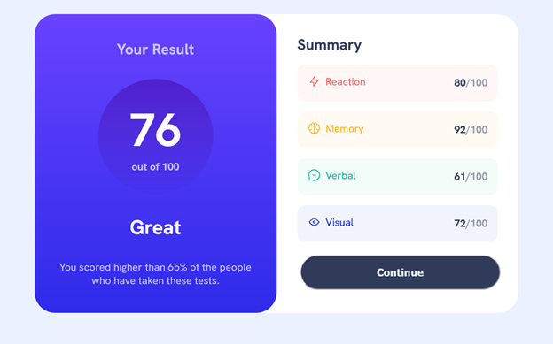
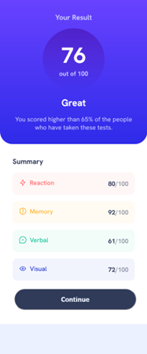

# Frontend Mentor - Results summary component solution

This is a solution to the [Results summary component challenge on Frontend Mentor](https://www.frontendmentor.io/challenges/results-summary-component-CE_K6s0maV). Frontend Mentor challenges help you improve your coding skills by building realistic projects. 

## Overview

### The challenge

Users should be able to:

- View the optimal layout for the interface depending on their device's screen size
- See hover and focus states for all interactive elements on the page
- Use the local JSON data to dynamically populate the content

### Screenshot

### Links

- Solution URL: [https://github.com/toshirokubota/result-summary-component-React](https://github.com/toshirokubota/result-summary-component-React)
- Live Site URL: [https://toshirokubota.github.io/result-summary-component-React/](https://toshirokubota.github.io/result-summary-component-React)

## My process

### Built with

- Semantic HTML5 markup
- CSS custom properties
- Grid
- Flexbox
- Mobile-first workflow
- SCSS/SASS
- React

### Continued development

This is my first project with React.js. I will keep practicing with it. 
I did not separate custome components into separate files. Just being lazy. No excuse...

### Useful resources

